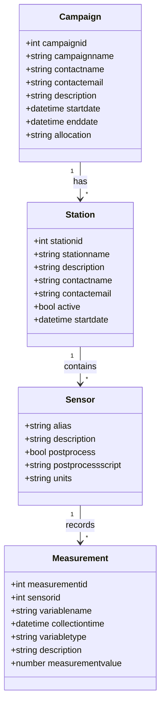

# Upstream API

A RESTful API service for managing environmental sensor data and campaigns.

## Installation & Setup

1. Clone the repository
2. Install dependencies (Docker and Docker Compose required)
3. Create a virtual environment and install dependencies:
   ```bash
   python -m venv .venv
   source .venv/bin/activate
   pip install -r requirements.txt
   pip install -r requirements-dev.txt
   ```
4. Create a `.env` file and set the environment variables:
   ```bash
   cp .env.sample .env
   ```
5. Start containers:

   ```bash
   docker compose up -d
   ```

   or

   ```bash
   docker compose up -f docker-compose.dev.yml -d
   ```

6. Initialize the database:
   ```bash
   # Run database migrations
   alembic upgrade head
   ```

## On-premise Environment

### Setting up Dev Instance

1. SSH to the VM with your TACC credentials:

   ```bash
   ssh <tacc_username>@upstream-dso.tacc.utexas.edu
   ```

2. Switch to root:

   ```bash
   sudo su
   ```

3. Navigate to dev source code directory:

   ```bash
   cd ~/upstream-docker-original-branch
   ```

4. Verify you're on the correct branch (Original):

   ```bash
   git branch
   ```

5. Pull latest changes:

   ```bash
   git pull
   ```

6. Build Docker container (increment version_id):

   ```bash
   docker build -t app-mpackard-dev:<version_id> .
   ```

7. Navigate to dev instance directory:

   ```bash
   cd ~/upstream-dev
   ```

8. Update docker-compose.yml with new version_id:

   ```bash
   vim docker-compose.yml
   ```

9. Restart containers:

   ```bash
   ./burndown && ./burnup
   ```

10. Verify the updates at https://upstream-dso.tacc.utexas.edu/dev/

## Deployment

There are two instances running on upstream-dso.tacc.utexas.edu:

- **Production**: https://upstream-dso.tacc.utexas.edu
- **Development**: https://upstream-dso.tacc.utexas.edu/dev/

## Database Migrations

The project uses Alembic for database migrations. Key commands:

```bash
# Create a new migration
alembic revision --autogenerate -m "description"

# Apply migrations
alembic upgrade head

# Rollback last migration
alembic downgrade -1

# View migration history
alembic history
```

## Database Schema

The following diagram shows the relationships between the main entities in the system:


