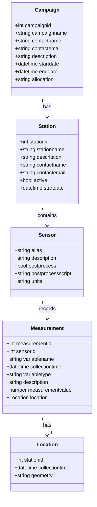

# upstream-docker

Class diagram

## How to update the DEV instance

As of the moment of writing these instructions, there're
_two_ upstream-dso instances running on the same VM (upstream-dso.tacc.utexas.edu): **production**, which can be accessed through https://upstream-dso.tacc.utexas.edu, and **dev** - https://upstream-dso.tacc.utexas.edu/dev/ .

1. ssh to the VM with your TACC's credentials
   `ssh <tacc_username>@upstream-dso.tacc.utexas.edu`
1. login as root
   `sudo su`
1. navigate to the dev source code's directory
   `cd ~/upstream-docker-original-branch`
1. verify the branch (**Original** for the dev's instance)
   `git branch`
1. pull the changes from **Original** branch
   `git pull`
1. (Re)build the Docker container (and increment the "version_id" (e.g., from 11 to 12))
   `docker build -t app-mpackard-dev:<version_id> .`
1. navigate to the directory for running the dev instance
   `cd ~/upstream-dev`
1. update the **docker-compose.yml** file to reflet the new image, i.e.<version_id> (see Step 6)
   `vim docker-compose.yml`
1. from the same directory (~/upstream-dev) run two bash scripts that stop and run the containers
   `./burndown && ./burnup`
1. navigate to https://upstream-dso.tacc.utexas.edu/dev/ to see the updates
