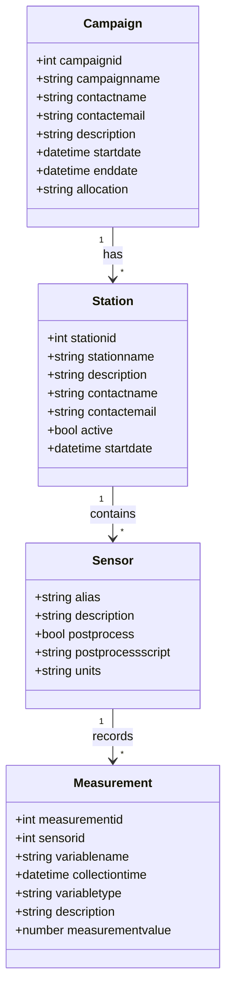

# Upstream API

A RESTful API service for managing environmental sensor data and campaigns.

## Installation & Setup

1. Clone the repository
2. Install dependencies (Docker and Docker Compose required)
3. Create a virtual environment and install dependencies:
   ```bash
   python -m venv .venv
   source .venv/bin/activate
   pip install -r requirements.txt
   pip install -r requirements-dev.txt
   ```
4. Create a `.env` file and set the environment variables:
   ```bash
   cp .env.sample .env
   ```
5. Start containers:

   ```bash
   docker compose up -d
   ```

   or

   ```bash
   docker compose -f docker-compose.dev.yml  up -d
   ```

   or just the database:

   ```bash
   docker compose -f docker-compose.dev.yml up -d db
   ```

6. Initialize the database:

   ```bash
   # Run database migrations
   alembic upgrade head
   ```

7. Run the application for development:

   ```bash
   fastapi dev app/main.py
   ```

## On-premise Environment

### Setting up environments

1. SSH to the VM with your TACC credentials:

   ```bash
   ssh <tacc_username>@upstream-dso.tacc.utexas.edu
   ```

2. Switch to root:

   ```bash
   sudo su
   ```

3. Enter to the prod directory or dev directory depending on what you want to do:

   ```bash
   cd ~/upstream-dev
   cd ~/upstream-prod
   ```

4. Change the IMAGE_TAG (commit hash, e.g. sha-a0fe1e7) in the .env file. You can find [here](https://github.com/In-For-Disaster-Analytics/upstream-docker/pkgs/container/upstream-docker) the latest commit hash.

   ```bash
   vim .env
   ```

5. Restart the containers:

   ```bash
   docker-compose up -d
   ```

## Deployment

There are two instances running on upstream-dso.tacc.utexas.edu:

- **Production**: https://upstream-dso.tacc.utexas.edu/docs/
- **Development**: https://upstream-dso.tacc.utexas.edu/dev/docs/

## Database Migrations

The project uses Alembic for database migrations. Key commands:

```bash
# Create a new migration
alembic revision --autogenerate -m "description"

# Apply migrations
alembic upgrade head

# Rollback last migration
alembic downgrade -1

# View migration history
alembic history
```

## Database Schema

The following diagram shows the relationships between the main entities in the system:



```

```
