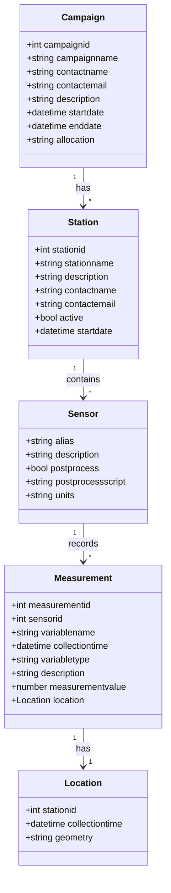

# upstream-docker

Class diagram
 

```mermaid
classDiagram
    class Campaign {
        +int campaignid
        +string campaignname
        +string contactname
        +string contactemail
        +string description
        +datetime startdate
        +datetime enddate
        +string allocation
    }

    class Station {
        +int stationid
        +string stationname
        +string description
        +string contactname
        +string contactemail
        +bool active
        +datetime startdate
    }

    class Sensor {
        +string alias
        +string description
        +bool postprocess
        +string postprocessscript
        +string units
    }

    class Measurement {
        +int measurementid
        +int sensorid
        +string variablename
        +datetime collectiontime
        +string variabletype
        +string description
        +number measurementvalue
        +Location location
    }

    class Location {
        +int stationid
        +datetime collectiontime
        +string geometry
    }

    Campaign "1" --> "*" Station : has
    Station "1" --> "*" Sensor : contains
    Sensor "1" --> "*" Measurement : records
    Measurement "1" --> "1" Location : has
```
